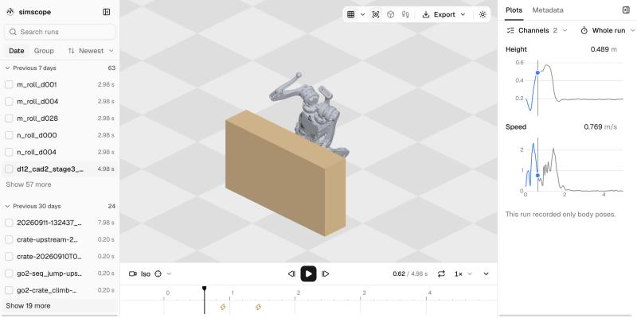

[](https://github.com/senthurayyappan/simscope/actions/workflows/ci.yml)
[](https://senthurayyappan.github.io/simscope/)
[](https://github.com/senthurayyappan/simscope/blob/main/pyproject.toml)
[](https://github.com/senthurayyappan/simscope/blob/main/LICENSE.md)

simscope records robot simulation rollouts and replays ones you already have. It opens a folder of them in the browser and exports any rollout as one HTML file that plays offline.

## Install

simscope needs Python 3.12 or newer and [uv](https://docs.astral.sh/uv/getting-started/installation/). It is not on PyPI yet, so work from a clone:

```bash
git clone https://github.com/senthurayyappan/simscope
cd simscope
uv sync --extra viewer --extra mujoco
```

The built browser code is part of the repository, so you do not need Node to use it.

## Quickstart

```bash
uv run python examples/viewer_demo.py --out rollouts
uv run simscope serve rollouts
uv run simscope ls rollouts
uv run simscope export rollouts box_drop -o box.html
uv run simscope export rollouts box_drop -o box.html --ui full
```

`serve` opens http://127.0.0.1:8080. `--ui full` writes the whole viewer. The default export is the player page.

## Example

A recording wraps the simulation loop. This one drops a box and logs its pose, its contact forces, and its height:

```python
import mujoco
import simscope
from simscope import mujoco as smj

model = mujoco.MjModel.from_xml_string(
    "<mujoco><worldbody><geom type='plane' size='2 2 0.1'/>"
    "<body pos='0 0 1'><freejoint/><geom type='box' size='.1 .1 .1'/></body>"
    "</worldbody></mujoco>"
)
data = mujoco.MjData(model)

lib = simscope.Library("rollouts")
with lib.record("drop", scene=smj.scene_from_model(model), dt=0.02) as rec:
    smj.add_contacts_stream(rec, model, max_contacts=16)
    for _ in range(100):
        for _ in range(10):
            mujoco.mj_step(model, data)
        rec.log(
            smj.poses(data),
            contacts=smj.contacts(model, data, max_contacts=16),
            height=float(data.xpos[1, 2]),
        )
```

Open the rollout. The camera follows the box, the plot shows `height`, and the timeline marks the landing as a peak in center-of-mass acceleration and a peak in net contact force. Contact forces are drawn as arrows.

For Isaac Lab, use `simscope.isaaclab` inside that environment: `scene_from_env`, `PoseBuffer`, and `contacts`.

To replay a rollout you already have, point `simscope import` at a `.rbundle` file or a Brax HTML page, then serve that folder.

## Features

- [Browse](https://senthurayyappan.github.io/simscope/getting-started/) a folder by date or by group. Search, rate, pin, and add notes.
- [Compare](https://senthurayyappan.github.io/simscope/getting-started/#exports) up to four rollouts on one clock. Cameras and ground stay aligned.
- The timeline marks peaks in contact force and in center-of-mass acceleration. [Add your own markers](https://senthurayyappan.github.io/simscope/getting-started/#custom-markers).
- Follow a body. Switch among iso, front, side, and top. Toggle contacts and collision shapes.
- [Export](https://senthurayyappan.github.io/simscope/getting-started/#exports) one HTML file. `--ui lean` is the player. `--ui full` is the whole app.
- Import a `.rbundle` file or a Brax HTML page.
- Thousands of envs stay interactive. Nearby envs are drawn in full. The rest are simple shapes.
- Put an export on an [mkdeck](https://github.com/senthurayyappan/mkdeck) slide: ``.

The [documentation](https://senthurayyappan.github.io/simscope/) covers the workflow, the [CLI](https://senthurayyappan.github.io/simscope/cli/), and the [API](https://senthurayyappan.github.io/simscope/api/). [Design](https://senthurayyappan.github.io/simscope/design/) records why simscope exists and the decisions behind it.

## Develop

```bash
make install
make check
make test
```

The [developing guide](https://senthurayyappan.github.io/simscope/developing/) covers the browser build and where to add an adapter or a marker.

## Contribute and license

Bug reports and pull requests are welcome, so read [CONTRIBUTING.md](https://github.com/senthurayyappan/simscope/blob/main/CONTRIBUTING.md) first.

simscope is [Apache 2.0](LICENSE.md) licensed. Copyright 2026 Senthur Ayyappan. The package also carries three.js, camera-controls, React, Radix, uPlot, Geist, and other libraries under their own licenses, and code adapted from mjviser. See [THIRD_PARTY_NOTICES.md](THIRD_PARTY_NOTICES.md).
